# Unscented-Kalman-Filter-Project

In this project an Unscented Kalman Filter is implemented in C++ to track a moving object (bicycle), while assuming a *"Constant Turn Rate & Velocity Magnitude" (CTRV)* Model, fusing both LIDAR and RADAR sensor data to accurately estimate the object's position.

This project involves the [Udacity's 2-D Simulator](https://github.com/udacity/self-driving-car-sim/releases) which is connected to the UKF via an open source package called uWebSocketIO. This package facilitates the connection between the simulator and the code executed. The package does this by setting up a web socket server connection from the C++ program to the simulator, which acts as the host.

This repository includes two files that can be used to set up and intall [uWebSocketIO](https://github.com/uWebSockets/uWebSockets) for either Linux or Mac systems.

Once the install for uWebSocketIO is complete, the main program can be built and ran by doing the following from the project top directory.

1. mkdir build
2. cd build
3. cmake ..
4. make
5. ./UnscentedKF

Here is the main protcol that main.cpp uses for uWebSocketIO in communicating with the simulator:

* INPUT: values provided by the simulator to the c++ program
    * ["sensor_measurement"] => the measurment that the simulator observed (either lidar or radar)

* OUTPUT: values provided by the c++ program to the simulator
    * ["estimate_x"] <= kalman filter estimated position x
    * ["estimate_y"] <= kalman filter estimated position y
    * ["rmse_x"]
    * ["rmse_y"]
    * ["rmse_vx"]
    * ["rmse_vy"]

---

## Other Important Dependencies
* cmake >= 3.5
* make >= 4.1
* gcc/g++ >= 5.4

## Basic Build Instructions
1. Clone this repo.
2. Make a build directory: `mkdir build && cd build`
3. Compile: `cmake .. && make`
4. Run it: `./UnscentedKF`

---

### The part implemented is all executed in the UKF instance method `UKF::ProcessMeasurement()` using the data input in the `MeasurementPackage` object: `meas_package`.
The input indicates:
1. Timestamp
2. Raw Measurements from Sensor
3. Sensor Type (RADAR or LASER)

### 1. Initialization
### Initialize a UKF upon detection of a sensor measurement:
1. Initialize the UKF instant attributes
   1. Declare the Dimensions of the State Vector `n_x_ = 5;` 
   2. Declare the Dimensions of the Augmented State Vector `n_aug_ = 7;`
   3. Declare the tuned standard deviation constants representing the process noise covariance:
         * Longitudinal Acceleration Noise - Standard Deviation `std_a_ = 0.75;`
         * YAW Acceleration Noise - Standard Deviation `std_yawdd_ = 0.75;`
   4. Calculate the Sigma Points' Spread Parameter `lambda_ = 3 - n_aug_;`
   5. Calculate the Sigma Points' Weight Vector of Size `2*n_aug + 1` for each of the 15 sigma point:
         * First Weight: `weights_(0) = lambda_ / (lambda_ + n_aug_);`
         * All Remaining Weights: `weights_ = 1 / (2*(lambda_ + n_aug_));`

2. Initialize UKF Vectors and Matrices:
   * State Vector x_: [Px, Py, v, yaw, yawdot]
        1. LIDAR Measurement: [Px, Py]
            * X Position = `Px;`
            * Y Position = `Py;`
            * Initialize Velocity v, Yaw Angle yaw, Turn Rate yawdot to `0`.
        
        2. RADAR Measurement: [rho, phi, rhodot]
           * X Position = `rho * cos(phi);`
           * Y Position = `rho * sin(phi);`
           * Initialize Velocity v, Yaw Angle yaw, Turn Rate yawdot to `0`.
           * Calculations based on the following visualization of the RADAR Measurements.
            

            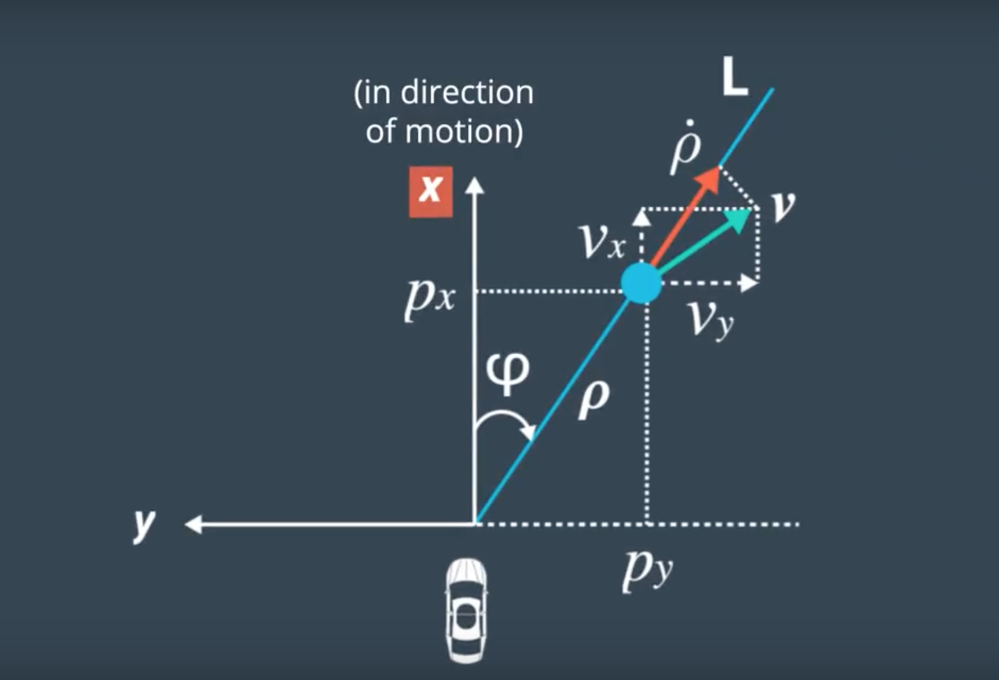
            

   
   * State Covariance Matrix P_:
      * Initialization for P_ is tuned manually for both LIDAR and RADAR measurements and the matrix below acquired the lowest RMSE results:

         P_ : Size (n_x_ x n_x_) --> (5 x 5)
         
              Px Var
               0.15     0     0     0     0
                      Py Var
                0      0.15   0     0     0
                            V Var
                0       0     50    0     0
                                 Yaw Var
                0       0     0     50    0
                                       YawDot Var
                0       0     0     0     50
                
   * Predicted Sigma Points Matrix `Xsig_pred_`: This matrix is initialized with zeros of size `(n_x_ x 2*n_aug_+1)` --> (5 x 15)
   
3. Initialize time to `MeasurementPackage::timestamp_` to calculate `delta_t` between both current and next measurement.
4. Set `is_initialized_` to `true` to start Prediction and Update Steps upon the next sensor measurement.

### 2. Prediction `UKF::Prediction()`
***Regardless of the type of input sensor type `meas_package.sensor_type_`:RADAR and LIDAR - the algorithm executes the same prediction functions***

1. Calculate the Augmented State Vector `x_aug` and Augmented State Covariance `P_aug`.
2. Generate 15 Augmented Sigma Points `Xsig_aug` for Previous estimated State Vector. Size > `(n_aug_ x 2*n_aug_+1)`: (7 x 15)
3. Predict Sigma Points representing the Current State Vector `Xsig_pred_`. Size > `(n_x_ x 2*n_aug_+1)`: (5 x 15)
4. Use predicted sigma points to estimate state mean `x_` and covariance `P_` using the precalculated `weights_`.

### 3. Update and Correction `UKF::UpdateLidar()` & `UKF::UpdateRadar()`
***LIDAR and RADAR sensor data are treated differently since LIDAR data are in CARTESIAN coordinates, while RADAR data are in POLAR coordinates***

1. Use Predicted Sigma Points `Xsig_pred_` and transform it to measurement space according to the sensor type:
   * LIDAR - 2 Dimensions Measurement Space:
      1. Calculate Sigma Points in measurement space `Zsig` using Px and Py from the Predicted Sigma Points `Xsig_pred_`. Size (2 x 15)
      2. Calculate Mean State `z_` and Covariance `S` from `Zsig`. z_ - Size: 2x1 and S - Size: 2x2
      3. Add Measurement Noise Covariance `R` to `S` 
         * `R` Matrix includes sensor covariance for Px and Py. Size (2 x 2)
   * RADAR - 3 Dimensions Measurement Space:
      1. Calculate Sigma Points in measurement space `Zsig` using Px, Py, v and yaw from the Predicted Sigma Points `Xsig_pred_`. Size (3 x 15)
         * `rho = sqrt( pow(px,2) + pow(py,2) );`
         * `phi = atan2(py,px);`
         * `rhodot = (px * cos(yaw) * v + py * sin(yaw) * v) / rho;`
      2. Calculate Mean State `z_` and Covariance `S` from `Zsig`. z_ - Size: 3x1 and S - Size: 3x3
      3. Add Measurement Noise Covariance `R` to `S` 
         * `R` Matrix includes sensor covariance for rho, phi and rhodot. Size (3 x 3)

2. Calculate Cross-correlation matrix `T` between Sigma Points in state space (5-d) and measurement space (2-d for LIDAR and 3-d for RADAR)

3. Calculate Kalman Gain `K`

4. Update (Correct) predicted State Vector `x_` and Covariance `P_`

### 4. RMSE and NIS Results
#### ***RMSE: Root Mean Squared Error***
#### ***NIS: Normalized Innovation Squared***

* RMSE values are calculated by comparing the estimated state positions with the ground truth.

* NIS values are calculated seperately and output in separate files for RADAR and LIDAR, determining the difference between predicted and actual measurement, while relating to the predicted measurement covariance matrix `S`.
   * RADAR has 3 Degrees of Freedom. (3-D)  X^2.950: 0.35 - X^2.050: 7.82
   * LIDAR has 2 Degrees of Freedom. (2-D)  X^2.950: 0.10 - X^2.050: 5.99
   * NIS follow chi squared distribution. 

### The UKF implemented was tested on two datasets: DataSet 1 and its inverse DataSet 2

#### DataSet 1:
RMSE: 
   * x_position: 0.0632
   * y_position: 0.0834
   * velocityX : 0.3092
   * velocityY : 0.2000

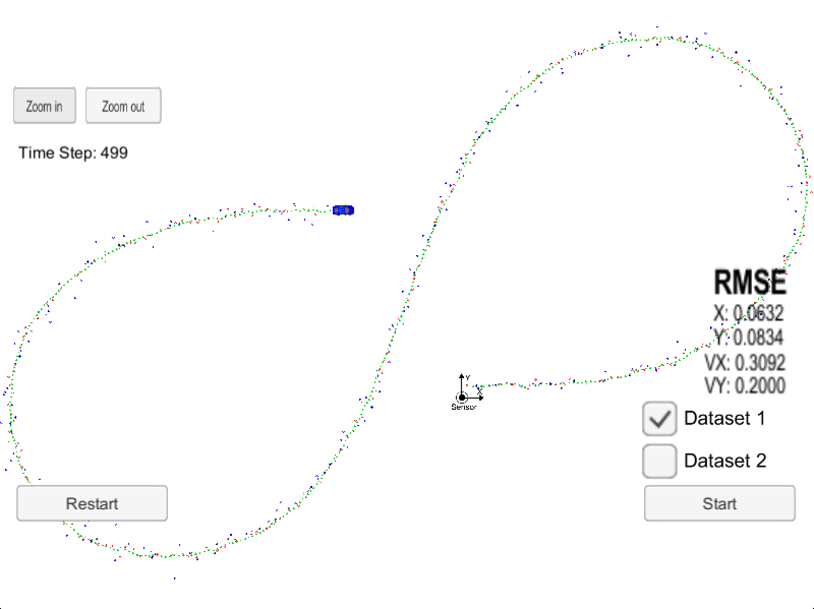

*The green markers in the image above shows the estimated position of the object, which regardless of the noisy measurements is really accurate.

* Position Plot of Estimated (Blue Markers) vs Ground Truth (Red Line)

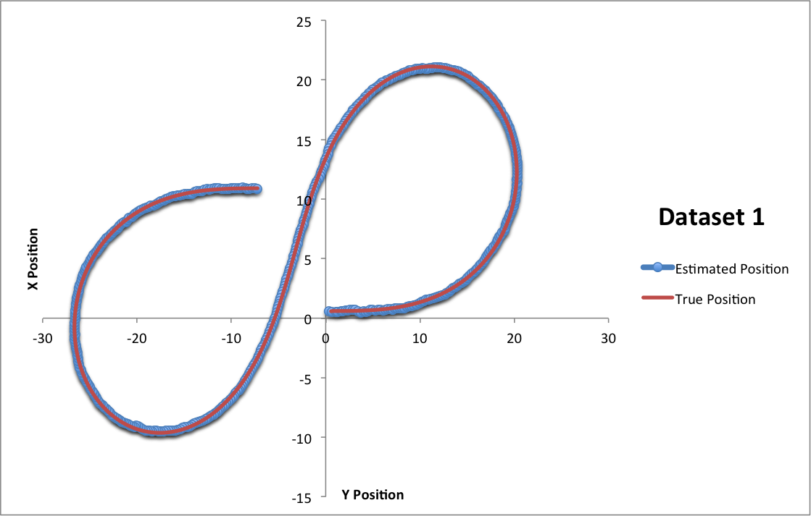

* Velocity Plot of Estimated (Blue Markers) vs Ground Truth (Red Line)

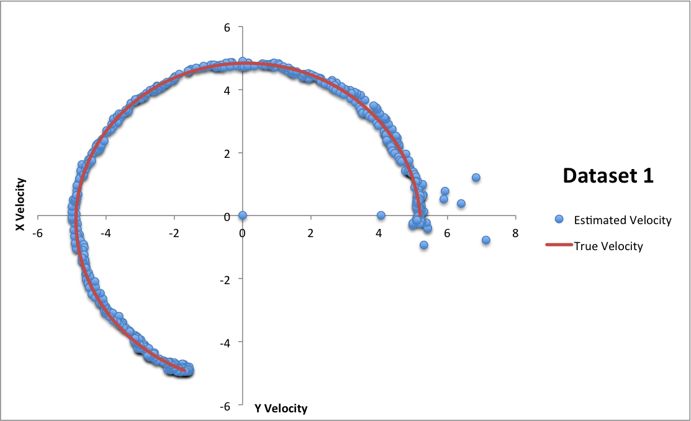

NIS:
* LIDAR Data with respect to X^2.950: 0.10 - X^2.050: 5.99

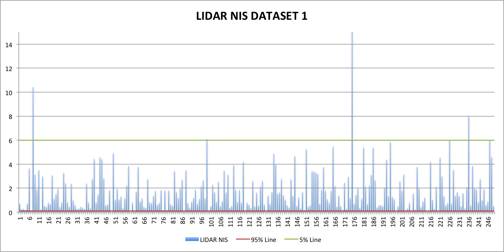

* RADAR Data with respect to X^2.950: 0.35 - X^2.050: 7.82

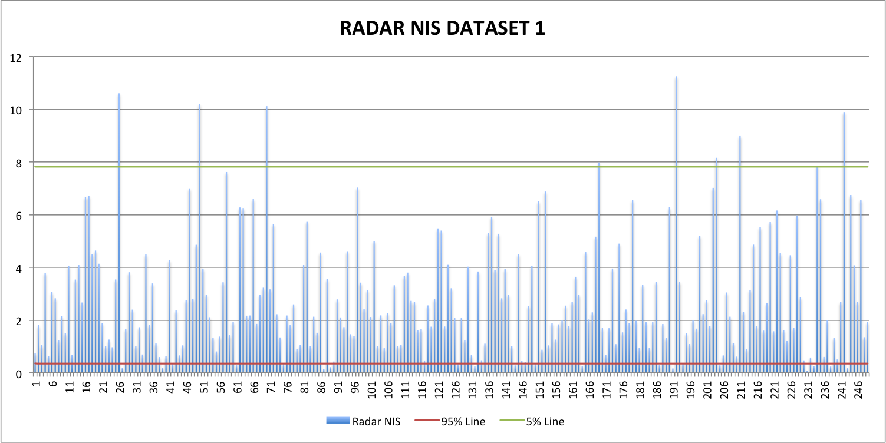

#### DataSet 2:
RMSE: 
   * x_position: 0.0637
   * y_position: 0.0604
   * velocityX : 0.3451
   * velocityY : 0.1802

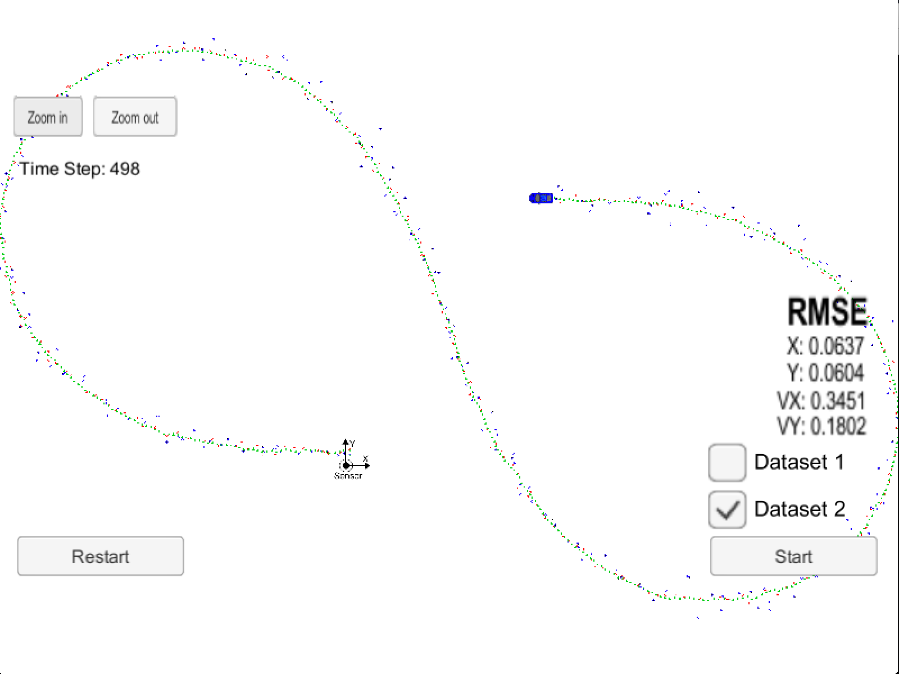

*The green markers in the image above shows the estimated position of the object, which regardless of the noisy measurements is really accurate.

* Position Plot of Estimated (Blue Markers) vs Ground Truth (Red Line)

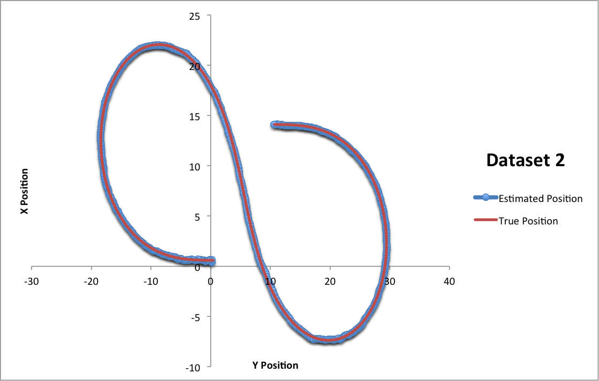

* Velocity Plot of Estimated (Blue Markers) vs Ground Truth (Red Line)

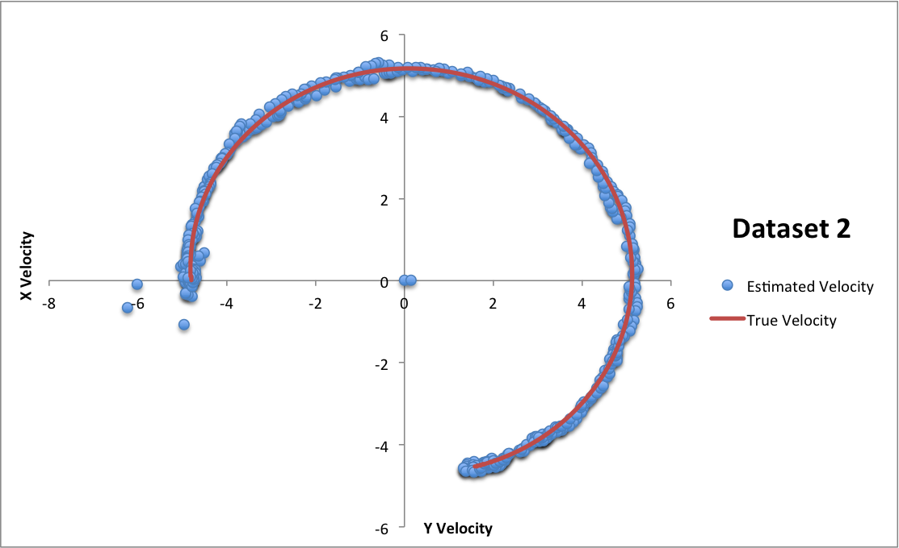

NIS:
* LIDAR Data with respect to X^2.950: 0.10 - X^2.050: 5.99

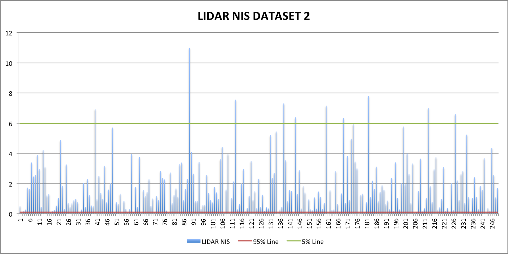

* RADAR Data with respect to X^2.950: 0.35 - X^2.050: 7.82

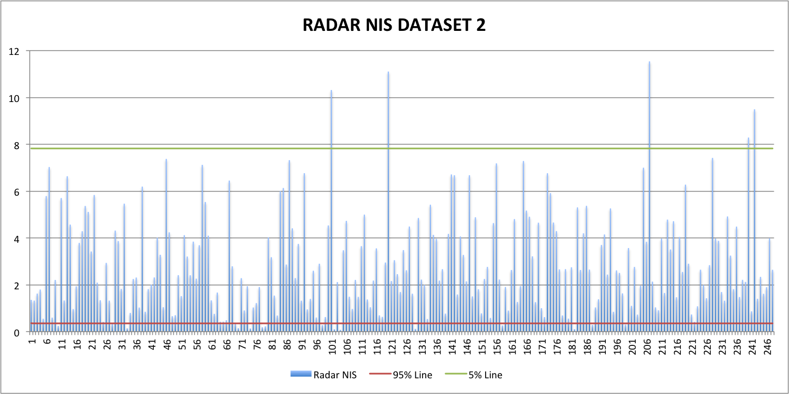

---
